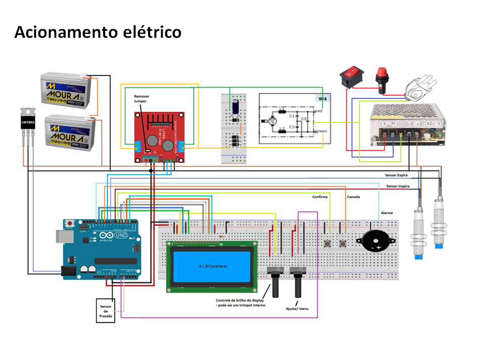

# Projeto-Ara-Plus
Repositório de projeto de Ventilador Pulmonar desenvolvido por estudantes e alunos da Universidade Federal do ABC (UFABC). Este é um trabalho em desenvolvimento, e ainda não está apto para casos clínicos. Futuras atualizações devem ser lançadas em breve.

## Origem do Nome
O nome "Ara" vem do Tupi-Guarani e significa "ar". Portanto o nome Ara-Plus reune uma palava genuinamente brasileira com uma palavra do inglês reconhecida em todo o mundo, significando literalmente "mais ar".

## Descrição geral do sistema

## Lista de Material
Descrição de todas os materiais e peças usados no Ara Plus separados por categorias:

### Partes Eletrônicas

-
-
-
### Partes Mecânicas

-
-
-
-
### Partes médicas

-
-
-
-

## Desenhos de Fabricação / Arquivos de CAD
As informações sobre os desenhos de fabricação das partes mecânicas do AraPlus encontram-se [aqui](desenhos/DESENHOS.md)

## Fotos

## Cronologia do Desenvolvimento
Data dos principais marcos do desenvolvimento do Ara-Plus

- 18/05/2020: Finalizada a montagem do projeto mecânico
- 06/04/2020: Submissão de projeto para edital interno de pesquisa
- 03/04/2020: Testes do protótipo conceitual
- 19/03/2020: Formação do grupo de desenvolvimento 
- 16/03/2020: Início da suspensão das aulas na UFABC devido à pandemia
- 11/03/2020: Declaração de pandemia de COVID-19 pela OMS

## Financiamento
Este projeto foi contemplado pela chamada Interna de Prospecção Para Apoio a Projetos e Ações de Pesquisa, Inovação, Extensão e Extensão Tecnológica para o Enfrentamento da Emergência de Saúde Pública Decorrente da COVID-19 da reitoria da UFABC.
Valor do financiamento: R$ 8.957,60

[http://www.ufabc.edu.br/images/reitoria/documentos/edital-42_2020-chamada-de-propostas-covid-19.pdf]

Maiores informações sobre editais com os respectivos projetos submetidos encontram-se [aqui](editais/EDITAIS.md).

## Lista de Compras 
Tabela com todos os itens adquiridos para o desenvolvimento deste projeto

Data da Compra  | Descrição do item | Quem comprou? | Origem do Recurso | Valor (R$)  
--------------- | ------------------|---------------|-------------------|------------
01/01/1900 | Exemplo 1 | Olavo | Do bolso | 10,00 
02/01/1900 | Exemplo 2 | Fulano | Edital UFABC | 20,00 
03/01/1900 | Exemplo 3 | Cicrano | Doação empresa XX | 0,00 

## Glossário
Aqui encontram-se os principais termos e siglas usados no desenvolvimento deste projeto juntamente com o seu significado:
- AMBU
- Filtro HEPA  = High Efficiency Particulate Air 
- Filtro HMEF
- Filtro Humidificador
- PEEP: Positive end-expiratory pressure ou Pressão Positiva ao Final da Expiração (https://en.wikipedia.org/wiki/Positive_end-expiratory_pressure)
- Válvula VAP (?)
- Válvula VUP
- PCV = Pressão Controlada Ciclado a Tempo;
- VCV = Volume Controlado ou Ciclado a Volume;
- PSV = Ventilação com Pressão de Suporte HEPA
- FiO2 = Fração Inspirada de Oxigênio,

## Equipe
- [Olavo Luppi Silva](http://ebm.ufabc.edu.br/docentes/olavo-luppi/) - Professor Adjunto - Eng. Biomédica/UFABC
- [Erick Dario León Bueno de Camargo](http://ebm.ufabc.edu.br/docentes/erickleon/) - Professor Adjunto - Eng. Biomédica/UFABC
- Hermann Windisch Neto - Aluno de doutorado no programa de [Biotecnociência/UFABC](http://propg.ufabc.edu.br/biotecnociencia/)
- Victor Allisson da Silva - Aluno da graduação da Engenharia Biomédica/UFABC
- Danilo Luna Campos - Aluno da graduação da Engenharia Biomédica
- Paulo Rodrigues - Aluno especial de mestrado no [PPGEBM](http://ebm.ufabc.edu.br/pos-graduacao/ppgebm/)
- Ana Tércia Lacerda de Araújo - Aluna de graduação do BC&T
- Ivan Correia Lima Coqueiro - Aluno de graduação do BC&T
- Jaqueline Badanai - Aluna de mestrado da [PPGEBM](http://ebm.ufabc.edu.br/pos-graduacao/ppgebm/)
- Danilo Buchdid - Colaborador externo
- Roberto Asano Junior - Pesquisador Pós-Doc - [Energia/UFABC](http://pgene.ufabc.edu.br)
- Edson Rodrigues - Aluno de mestrado no [PPGEBM](http://ebm.ufabc.edu.br/pos-graduacao/ppgebm/)
- [Patrícia Teixeira Leite Asano](http://cecs.ufabc.edu.br/index.php/docentes/contatos/23-docentes/143-patricia-teixeira-leite-asano.html) - Professor Associado - Eng. Energia/UFABC

## Parceiros
 - FMABC: testes clínicos
 - Ventisilva: manufatura

## Agradecimentos
 Dcryl Design em Acrílico (Campinas)
 
 Instituto Mauá de Tecnologia
 
