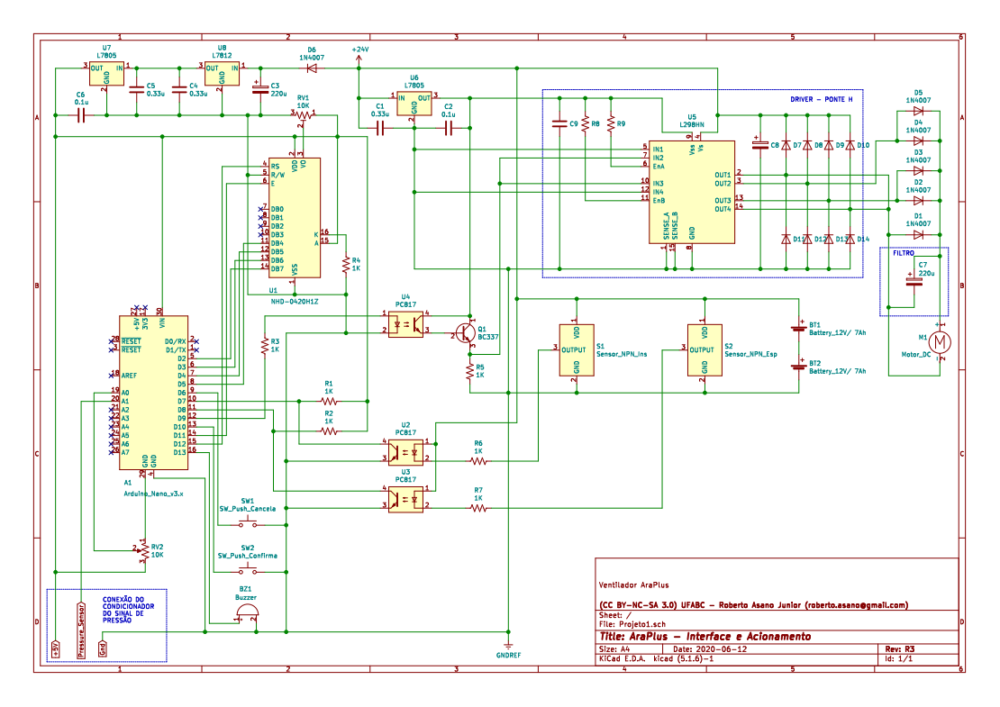

# Projeto-Ara-Plus
Repositório de projeto de Ventilador Pulmonar desenvolvido por estudantes e alunos da Universidade Federal do ABC (UFABC). Este é um trabalho em desenvolvimento, e ainda não está apto para casos clínicos. Futuras atualizações devem ser lançadas em breve.

## Origem do Nome
O nome "Ara" vem do Tupi-Guarani e significa "ar". Portanto o nome Ara-Plus reune uma palava genuinamente brasileira com uma palavra do inglês reconhecida em todo o mundo, significando literalmente "mais ar".

## Descrição geral do sistema

### Requisitos

Conforme destacado pela AMIB – [Associação de Medicina Intensiva Brasileira]() – em sua nota técnica ["Nota técnica sobre características de aparelhos ventiladores artificiais no suporte ao paciente com COVID-19"](http://www.amib.org.br/fileadmin/user_upload/amib/2020/abril/26/Nota_te__cnica_sobre_caracteri__sticas_de_aparelhos_ventiladores_artificiais_no_suporte_ao_paciente_com_COVID-19.pdf) de 26 de abril de 2020 e que atualmente (29/05/2020) subsidia o [PROJETO DE LEI N° 2294, DE 2020, em tramitação no senado,](https://www25.senado.leg.br/web/atividade/materias/-/materia/142132): "No atual cenário de pandemia por COVID-19, diante de uma situação de exceção decorrente do grande número de pacientes com necessidade de ventilação mecânica, listamos abaixo as especificações MÍNIMAS que um ventilador mecânico deve apresentar para ventilar pacientes com COVID-19, em qualquer unidade (pronto socorro, UTI ou outras unidades). Essas características devem estar presentes, independentemente de o equipamento ser ventilador de transporte ou não, ser novo ou reformado:
1. MODOS VCV e/ou PCV;
2. CONTROLE DE DELTA DE PRESSÃO (SOBRE A PEEP) NO MODO PCV (DE 5 A 30 cmH2O) E CONTROLE DE VOLUME CORRENTE INSPIRADO NO MODO VCV (de 50 A 700 ML);
3. CONTROLE DE FiO2 (21 a 100%);
4. PEEP (0 ATE 20 cm H2O);
5. CONTROLE DE TEMPO INSPIRATÓRIO (NO MODO PCV) EM SEGUNDOS (0,3 - 2,0 S) E FLUXO INSPIRATÓRIO (NO MODO VCV) - ATÉ 70L/MIN;
6. CONTROLE DE FREQUÊNCIA RESPIRATÓRIA - 8 a 40 RPM;
7. MEDIDA DE PRESSÃO DE VIAS AÉREAS (MANÔMETRO ANALÓGICO OU DIGITAL);
8. MEDIDA DE VOLUME CORRENTE EXPIRADO SEMPRE QUE POSSÍVEL;
9. ALARME DE PRESSÃO MÁXIMA EM VIAS ÁEREAS, VAZAMENTO E QUEDA DE REDE DE GASES;
10. POSSIBILIDADE DE ANEXAR FILTRO TIPO HEPA DE ALTA CAPACIDADE (N99 OU N100) NO RAMO EXPIRATÓRIO;
11. SE POSSÍVEL, POSSUIR BATERIA COM PELO MENOS 2 HORAS DE CAPACIDADE."

## Lista de Material
Descrição de todas os materiais e peças usados no Ara Plus separados por categorias:

### Partes Eletrônicas

**Diagrama elétrico do acionamento**

**Lista de materiais do acionamento**
 | Referência | Quantidade | Especificação | 
 | --------------- | --------------- | --------------- | 
 | A1 | 1 | Arduino_Nano_v3.x | 
 | BT1, BT2 | 2 | Bateria_12V/ 7Ah | 
 | BZ1 | 1 | Buzzer ativo 5V | 
 | C1, C3, C4 | 3 | Capacitor 0.33uF | 
 | C2, C5 | 2 | Capacitor 0.1uF | 
 | D1, D2, D3, D4, D5 | 5 | Diodo 1N4007 | 
 | M1 | 1 | Motor_DC | 
 | Q1 | 1 | Transistor BC337 | 
 | R1, R2 | 2 | Resistor 10K | 
 | RV1 | 1 | Trimpot 10K | 
 | RV2 | 1 | Potenciômetro 10K | 
 | R3, R5, R6, R7, R8 | 5 | Resistor 1K | 
 | R4 | 1 | Resistor 150R | 
 | S1, S2 | 2 | Sensor_Indutivo_NPN 12mm | 
 | SW1, SW2 | 2 | Acionador_Push_Buttom | 
 | U1 | 1 | Display alfanumérico 4 x 20 NHD-0420H1Z | 
 | U2, U3, U4 | 3 | Optoacoplador PC817 | 
 | U5 | 1 | Módulo Ponte H - L298N | 
 | U6, U7 | 2 | Regulador L7805 | 
 | U8 | 1 | Regulador L7812 | 
 | +24V | 1 | Fonte 24V - 5A |

### Partes Mecânicas

-
-
-
-
### Partes médicas

Propostas em estudo do circuito pneumático:

**Tipo 1 - Com válvula VUP**

**Tipo 2 - Com Diverter e a válvula VAP tampada de um lado**

**Tipo 3 - Com a hipótese do *Diverter* para encaixe na VAP**

## Desenhos de Fabricação / Arquivos de CAD
As informações sobre os desenhos de fabricação das partes mecânicas do AraPlus encontram-se [aqui](desenhos/DESENHOS.md)

## Fotos

## Cronologia do Desenvolvimento
Data dos principais marcos do desenvolvimento do Ara-Plus

- 07/06/2020: Finalizada a montagem do circuito de acionamento e controle
- 06/06/2020: Elaboração das propostas de circuito pneumático
- 03/03/2020: Correções a aprimoramento do acionador mecânico
- 01/06/2020: Submissão do projeto para [edital IEEE](https://hac.ieee.org/funding-opportunities/covid-19-projects/)
- 34/05/2020: Calibração do circuito condicionador do transdutor de pressão MPS20
- 18/05/2020: Finalizada a montagem do projeto mecânico
- 27/04/2020: Desenho mecânico do protótipo para testes
- 06/04/2020: Submissão de projeto para edital interno de pesquisa
- 03/04/2020: Testes do protótipo conceitual
- 19/03/2020: Formação do grupo de desenvolvimento 
- 16/03/2020: Início da suspensão das aulas na UFABC devido à pandemia
- 11/03/2020: Declaração de pandemia de COVID-19 pela OMS

## Financiamento
Este projeto foi contemplado pela chamada Interna de Prospecção Para Apoio a Projetos e Ações de Pesquisa, Inovação, Extensão e Extensão Tecnológica para o Enfrentamento da Emergência de Saúde Pública Decorrente da COVID-19 da reitoria da UFABC.
Valor do financiamento: R$ 8.957,60

[http://www.ufabc.edu.br/images/reitoria/documentos/edital-42_2020-chamada-de-propostas-covid-19.pdf]

Maiores informações sobre editais com os respectivos projetos submetidos encontram-se [aqui](editais/EDITAIS.md).

## Lista de Compras 
Tabela com todos os itens adquiridos para o desenvolvimento deste projeto

Data da Compra  | Descrição do item | Quem comprou? | Origem do Recurso | Valor (R$)  
--------------- | ------------------|---------------|-------------------|------------
01/01/1900 | Exemplo 1 | Olavo | Do bolso | 10,00 
02/01/1900 | Exemplo 2 | Fulano | Edital UFABC | 20,00 
03/01/1900 | Exemplo 3 | Cicrano | Doação empresa XX | 0,00 

## Glossário
Aqui encontram-se os principais termos e siglas usados no desenvolvimento deste projeto juntamente com o seu significado:
- AMBU
- Filtro HEPA  = High Efficiency Particulate Air 
- Filtro HMEF
- Filtro Humidificador
- PEEP: Positive end-expiratory pressure ou Pressão Positiva ao Final da Expiração (https://en.wikipedia.org/wiki/Positive_end-expiratory_pressure)
- Válvula VAP (?)
- Válvula VUP
- PCV = Pressão Controlada Ciclado a Tempo;
- VCV = Volume Controlado ou Ciclado a Volume;
- PSV = Ventilação com Pressão de Suporte HEPA
- FiO2 = Fração Inspirada de Oxigênio,

## Equipe
- [Olavo Luppi Silva](http://ebm.ufabc.edu.br/docentes/olavo-luppi/) - Professor Adjunto - Eng. Biomédica/UFABC
- [Erick Dario León Bueno de Camargo](http://ebm.ufabc.edu.br/docentes/erickleon/) - Professor Adjunto - Eng. Biomédica/UFABC
- Hermann Windisch Neto - Aluno de doutorado no programa de [Biotecnociência/UFABC](http://propg.ufabc.edu.br/biotecnociencia/)
- Victor Allisson da Silva - Aluno da graduação da Engenharia Biomédica/UFABC
- Danilo Luna Campos - Aluno da graduação da Engenharia Biomédica
- Paulo Rodrigues - Aluno especial de mestrado no [PPGEBM](http://ebm.ufabc.edu.br/pos-graduacao/ppgebm/)
- Ana Tércia Lacerda de Araújo - Aluna de graduação do BC&T
- Ivan Correia Lima Coqueiro - Aluno de graduação do BC&T
- Jaqueline Badanai - Aluna de mestrado da [PPGEBM](http://ebm.ufabc.edu.br/pos-graduacao/ppgebm/)
- Danilo Buchdid - Colaborador externo
- Roberto Asano Junior - Pesquisador Pós-Doc - [Energia/UFABC](http://pgene.ufabc.edu.br)
- Edson Rodrigues - Aluno de mestrado no [PPGEBM](http://ebm.ufabc.edu.br/pos-graduacao/ppgebm/)
- [Patrícia Teixeira Leite Asano](http://cecs.ufabc.edu.br/index.php/docentes/contatos/23-docentes/143-patricia-teixeira-leite-asano.html) - Professor Associado - Eng. Energia/UFABC

## Parceiros
 - FMABC: testes clínicos
 - Ventisilva: manufatura
 
## Agradecimentos
 - Dcryl Design em Acrílico (Campinas)
 - Instituto Mauá de Tecnologia
 
