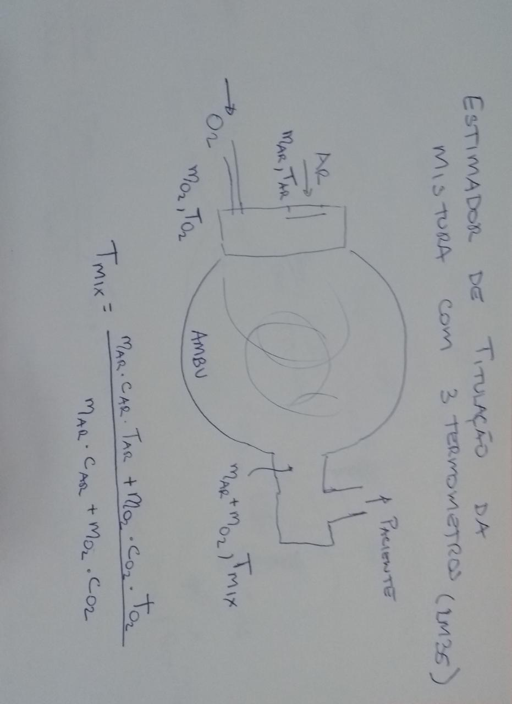

# Proposta de estimador de FI02 com 3 termometros

Estimar a relação de massas (e volume correlacionado) através da medição de temperaturas dos gases que entram no AMBU e o resultante da mistura.

## Referências para verificação:

Godoy ACF, Vieira RJ, Neto RJV. Oxygen outflow delivered by manually operated self-inflating resuscitation bags in patients breathing spontaneously. J Bras Pneumol. 2008;34(4):212-216. Disponível em: [https://www.jornaldepneumologia.com.br/detalhe_artigo.asp?id=385]

Godoy, Armando Carlos Franco de, & Vieira, Ronan José. (2009). Comparação da FiO2 fornecida por sete modelos de sistema balão-máscara auto-inflável. Revista Brasileira de Anestesiologia, 59(1), 21-27.  Disponível em: [https://doi.org/10.1590/S0034-70942009000100004] ou [https://www.scielo.br/scielo.php?script=sci_arttext&pid=S0034-70942009000100004]
