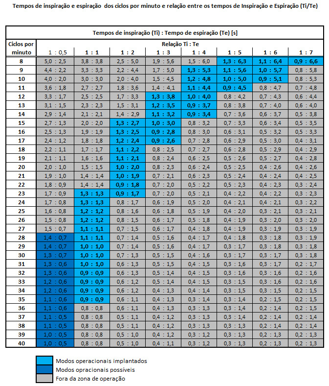

# Resultados dos testes com motor DC

- O motor DC foi avaliado por sua disponibilidade local, baixo custo e excelente torque em aplicações com redutores de rosca sem fim. 
- O uso do came permite ampliar a faixa de operação sem necessidade de inverter o sentido de rotação.
- Nas avaliações preliminares foi possível observar seu bom desempenho na função e produzindo pressão suficiente no AMBU.
- Com controles digitais foi possível ajustar os tempos de inspiração e expiração dentro de uma faixa relevante de operação.

- Embora na especificação estejam considerados MODOS VCV e/ou PCV alternativamente, a prática clínica protetiva aplicada aos pacientes de COVID tem sido executada exclusivamente em modo VCV.
- Embora o posicionamento do AMBU tenha se mostrado suficiente para controle da disponibilidade da mistura, o tempo inspiratório acabou sendo comprometido pelo limitado controle de velocidade.
- O volume também pôde ser controlado pelas válvulas de pressão. Neste caso, perde-se a mistura, eventualmente rica em Oxigênio.

### Alternativas

- Devido às dificuldades combinadas de controle de volume e faixa de tempos inspiratórios, decidiu-se explorar alternativa de atuadores com motor de passo e considerando reversão de direção de acionamento.
- Também é possível identificar aplicações para situações em que não há necessidade de Oxigênio e para ventilação protetiva em modo PCV.
