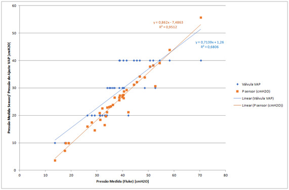
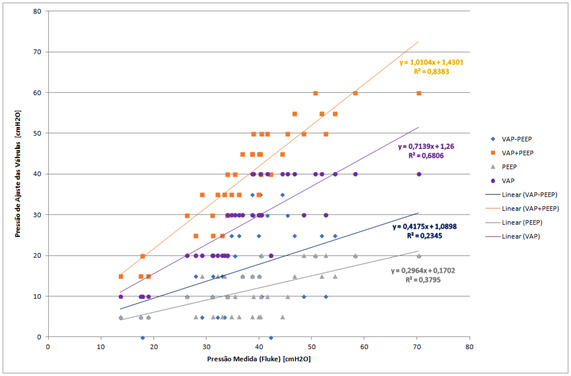
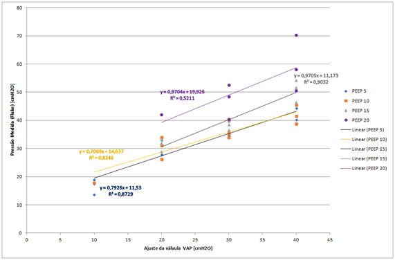
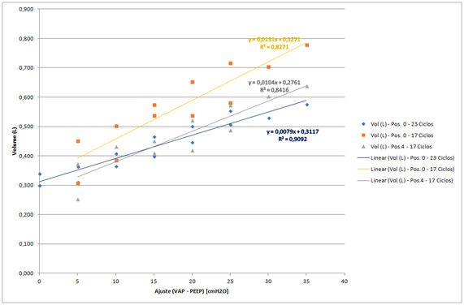
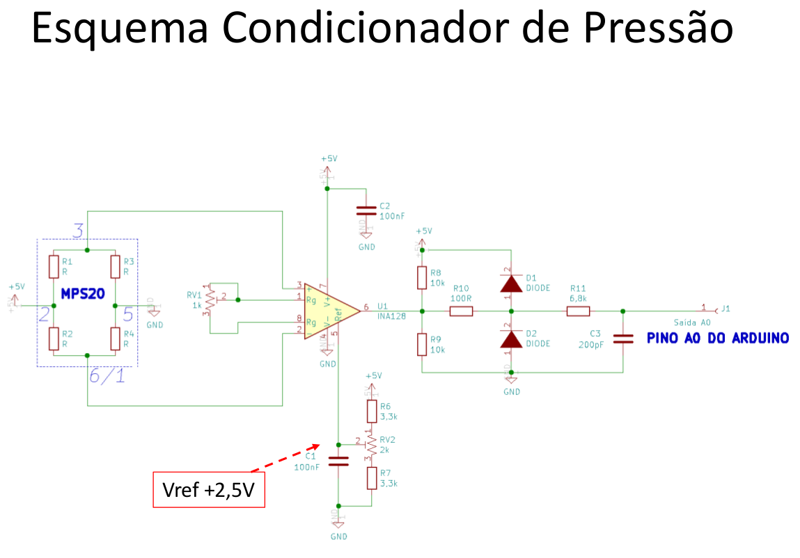
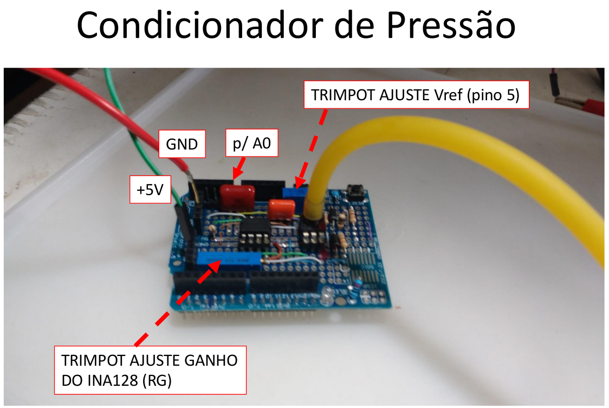
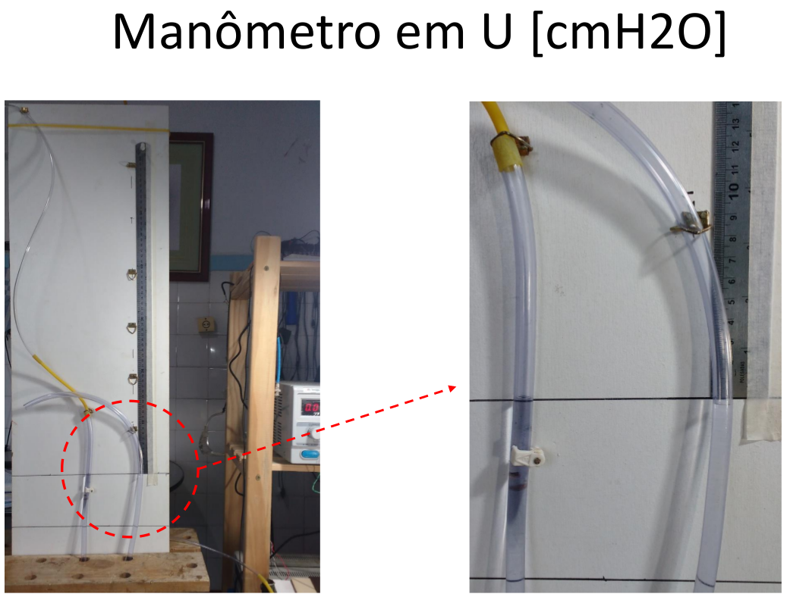
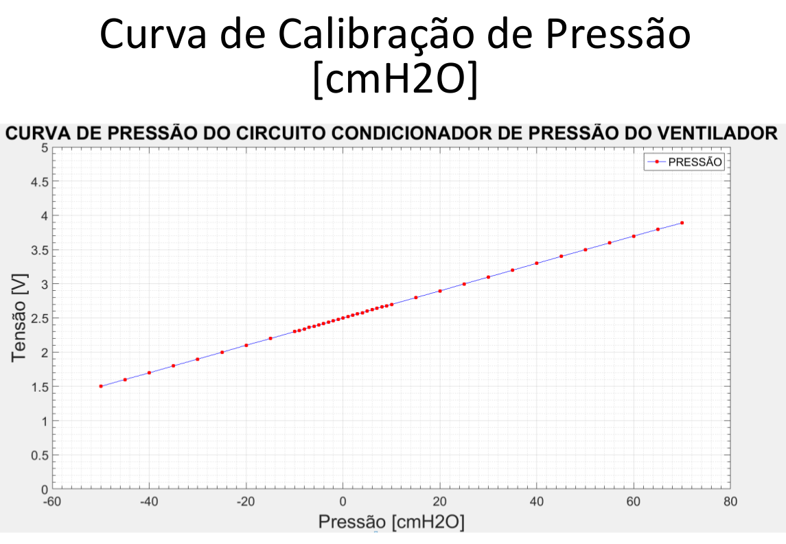

# Descrição dos Testes Funcionais de Bancada (in vitro)

## 1) Levantamento preliminar da Relação PEEP x Pressão Expiratória Máxima (Vál. VAP) x Freq. Respiratória x Volume Inspirado

### Descrição da Fig. 1: 
*Eixo x:* representa a leitura da pressão máxima no final da inspiração medida com o equipamento padrão ouro (Fluke).

*Eixo y :* apresenta a pressão regulada na válvula VAP (azul) ou a pressão medida no sensor de pressão do AraPlus (laranja).

### Conclusões

1.1 - A pressão da válvula VAP apresenta uma grande dispersão da pressão de atuação

1.2 - Sensor de pressão do AraPlus apresenta uma boa correlação e linearidade com o sensor padrão ouro.

1.3 - Equação de ajuste do sensor de pressão do AraPlus precisa ser revista, pois a calibração estática feita anteriormente não está batendo com as medições feitas com o padrão ouro. 

1.4 - Dǘvida: Deveríamos fazer a calibração pelo valor do pico da pressão, medida dinamicamente ou adquirir um manômetro profissional para fazer a calibração estática, uma vez que a calibração foi feita com uma manômetro em U caseiro?

1.5 - Será necessário estabelecer procedimento de calibração (analógica e/ou digital)

### Descrição da Fig. 2:

*Eixo x*: representa a leitura da pressão máxima no final da inspiração medida com o equipamento padrão ouro (Fluke).

*Eixo y* : apresenta a pressão que foi ajustada manualmente nas válvulas VAP e PEEP em quatro condições: apenas a VAP (roxo), apenas a PEEP (cinza), VAP+PEEP (laranja) VAP-PEEP (azul)

### Conclusões

2.1 - Setup da PEEP impacta na pressão máxima.

2.2 - Pressão máxima no final da inspiração tem alta correlação com a soma das pressões ajustadas manualmente PEEP+VAP, pois o coeficiente angular a curva laranja é próximo de 1. 

2.3 - A conclusão anterior leva a crer que ao regular a pressão na válvula VAP, o invés dela limitar a presão máxima ao final de inspiração, ela está funcionando como uma regulagem da Driving Pressure (DP), que é o delta de pressão que se coloca sobre a PEEP durante a inspiração (Pmax = DP + PEEP). 

### Descrição da Fig. 3:

*Eixo x:* representa a pressão que foi ajustada manualmente na válvula VAP 

*Eixo y:* representa a pressão de leitura do sensor padrão ouro (Fluke)

Este gráfico é plotagem dos dados mostrados na curva azul da Fig.1, porém discretizados para diferente valores de ajuste da válvula PEEP

### Conclusões
3.1 – Hipótese: a pressão máxima (VAP) deve ser ajustada em função de curvas para cada valor de PEEP ajustado.

### Descrição da Fig. 4:

*Eixo x:*  representa a diferença entre os dois valores ajustadoa manualmente entre VAP e PEEP

*Eixo y:* volume inspirado com o sensor padrão ouro (fluke)

### Conclusões
4.1 - Existe uma correlação razoável entre o volume e a diferença de pressão (VAP-PEEP).

4.2 - Dúvida: qual seria o significado da diferença VAP-PEEP?

4.3 - Hipótese: Para uma determinada complacência, o volume varia proporcionalmente com a posição do AMBU para qualquer ajuste das válvulas.

4.4 - Hipótese: Para uma determinada complacência, o volume por ciclo não varia proporcionalmente com o tempo de inspiração.

4.5 - Dúvida: valeria a pena continuar correlacionando as pressões de ajuste das válvulas VAP e PEEP com o volume inspirado uma vez que o AraPlus não mede volume e a complacência do pulmão varia de paciente para paciente?

## 2) Calibração Estática do Sensor de Pressão

### Descrição

Levantar curva de pressão medida pelo sensor MPX5500DP comparando com uma medição de pressão estática (com manômetro U ou manômetro analógico)

Diagrama elétrico do circuito de condicionamento de pressão utilizado no AraPlus

Implementação do circuito de condicionamento 

Foto do manômetro em U caseiro utilizado na calibração

### Resultados

## 3) Calibração Dinâmica (valores simulados)

Comparação das curvas de pressão e volume obtidas com um sensor de reverência (Analisador de Gases Fluke VT650) com as curvas de pressão obtidas com o simulador https://girardi.blumenau.ufsc.br/sdvm/, para os mesmos parâmetros ventilatórios.

## 4) Calibração Dinâmica (valores experimentais)

Comparação das curvas de pressão com um sensor de reverência, com as curvas de pressão efetivamente medidas com o sensor MPX5500DP. Obs: o analisador  Fluke aparentemente só exporta com uma frequência de amostragem máxima de 1Hz, o que não dá uma boa resolução das curvas. A solução seria usar o sensor Magnamed Ventmeter que tem interface RS232.